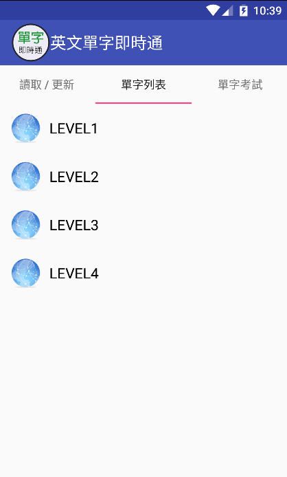
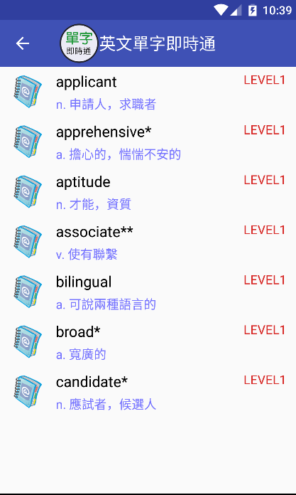

# EnglishWords

This project is built for english learner.

## Screenshot

## Release

* [v1.0.1](https://play.google.com/store/apps/details?id=tw.tonyyang.englishwords)

## Functionality

implemented:

* [v] import vocabulary from excel file
* [v] examination

TODO:

* [x] UI flow simplify

## Contributing

* Fork this project
* Create feature branch: `git checkout -b my-feature-branch`
* Commit your change
* Push to the branch: `git push origin my-feature-branch`
* Submit a pull request

## Author

* **Tony Yang** - initial & develop basic feature - [tonyyang924](https://github.com/tonyyang924)

## License

This project is licensed under the Apache-2.0 License - see the [LICENSE](LICENSE) file for details